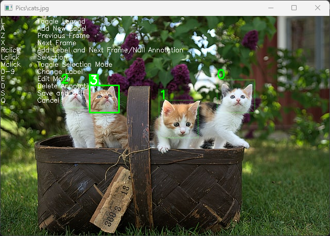
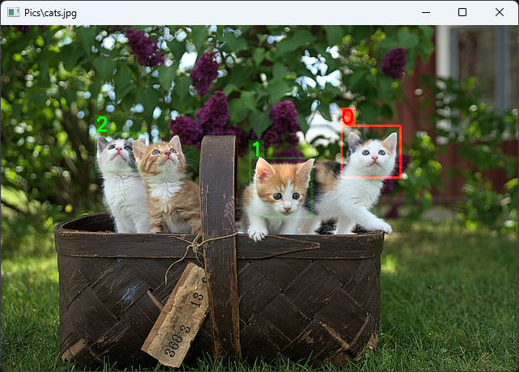

# fast_labler

Labeling pictues for your deep object localization projects can be extremly cumbersome and can distract you from the more fun part of the project like building and testing your model. I found that existing frameworks for labeling come with a lot of features but a very bloated GUI. For most projects just a few features are actually needed. Therfore I developed this utility for a very fast labeling of your pictues. It mostly uses keyboard shortcuts.

## How to use?
Simply clone or download this repository and make sure `fast_labler.py` is located in your project folder.
To use the fast labler insert 
`from fast_labler import FastLabler`
into your python code. After that you are ready to call the `FastLabler` utility. The utility itself is based on opencv. It also depends on os, numpy, and json. I included a Jupiter script `demo.ipynb` which demonstrates the basic use.

You can add bounding boxes with up to 10 different labels (0 to 9). The utility saves session info by default, which means you can resume the labeling process at any time in the future again. You can also edit or delete existing labels by entering the edit mode. By default all the controls are displayed in a legend but feel free to remove it by pressing "L" once you get comfortable with the controls. In the following you will find a table with all the possible input options.

This is what a normal labeling session would look like. Old annotations are displayed with some alpha, the current selection is highlighted.

This is what the edit mode looks like. You enter/exit it by pressing "E". The current selection is highlighted in red. You can delete it by pressing "D" or change its label by pressing 0-9 on you keyboard. Here the legend was toggled of by pressing "L".

## Keybord and Mouse Controls

| Input  | Description |
| ------------- | ------------- |
| `L` | Toggles the legend on/off |
| `A` | add bounding box at current selection |
| `Z` | previous frame, current selection is not saved |
| `X` | next frame, current selection is not saved |
| `Right CLick` | add bounding box at current selection, and proceeds to next frame. When you only have one label this means you can label all the pictues by only using your mouse! Right clicking without any selection adds an empty annotation which tells your deep learning algorithm that you labled the picture but no object is actually on screen. These pictues will add negative samples to your data set and will make the algorithm more robust. |
| `Left CLick` | starts a new selection, when in selection mode |
| `Middle CLick` | toggles the selection mode, i.e., either two corners of the bopunding box or its center point and one corner point |
| `0-9` | selects the label for the currrent selection in either the selection or editing mode |
| `E` | enters edit mode in case there is anything to edit |
| `D` | deletes the bounding box for the current selection in editing mode |
| `S` | saves and closes the Fast Labler, current selection is not saved |
| `Q` | closes the Fast Labler without saving the current session, current selection is not saved, the FastLabler utility will still return the current session to avoid frustration in case the button was pressed by accident |

## Function Parameters

The function `FastLabler` returns the data of the session so you can resume later.
`session_data = FastLabler(path_images, data={}, bound_selection=True, save_dict=True, save_json=False, path_annotations=None, rect_null=[-1, -1, -1, -1], show_legend=True, alpha=0.8)`

| Input  | Description | Default |
| ------------- | ------------- | ------------- |
| `path_images` | the path to the folder with the images you want to label/annotate | - |
| `data` | session data of a previous session to restore it, no argument starts new session | `{}` |
| `bound_selection` | bounds the selection to the pixel coordinates of the current image | `True` |
| `save_dict` | saves the current session data under the "path_annotations" folder | `True` |
| `save_json` | creates a annotation file for every annotated picture in the "path_annotations" folder. The format of the json file is in line with most pictue augmentation pipelines. | `False` |
| `path_annotations` | a path to a folder where the session data and/or the json annotations shall be saved. | `path_images` |
| `rect_null` | bounding box value for an empty annotation. The default empty label is -1. | `[-1, -1, -1, -1]` |
| `show_legend` | controls whether at the start of teh sessiuon the legend is displayed or not. It can still alwayes be turned on/off by pressing "L" | `True` |
| `alpha` | alpha value of old annotations | `0.8` |

